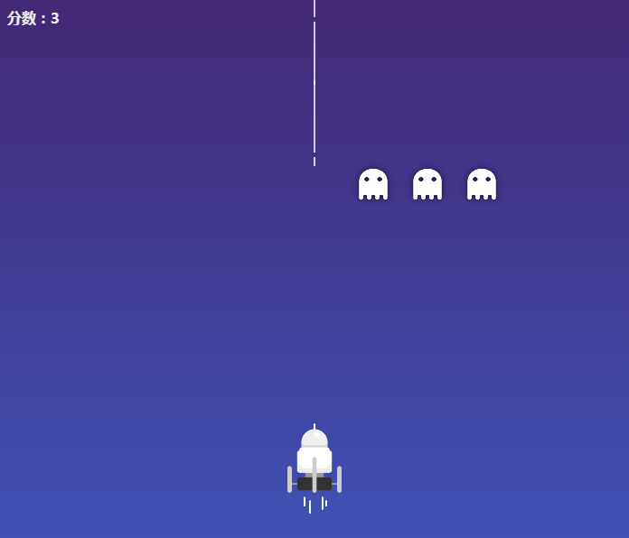
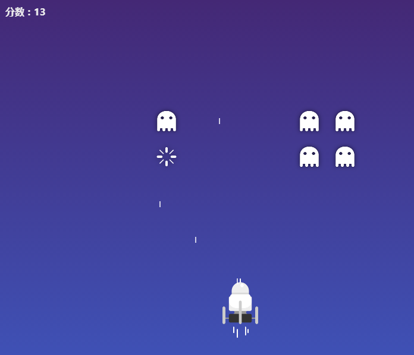

# planeGame
 基于canvas的射击游戏
 
## 项目引用方法
``` 
<!-- 引用css -->
<link rel="stylesheet" type="text/css" href="style.css">
<!-- 游戏区 -->
<div id="game"></div>
<!-- 引用js -->
<script type="text/javascript" src="./js/planeGame.js"></script>
<!-- 启动游戏 -->
<script type="text/javascript">
    var game = new PlaneGame();
</script>
```

## 项目结构
- **index.html**: 游戏页面
- **style.css**: 页面样式
- **js**: 页面涉及的所有 js 代码
  - **app.js**: 页面逻辑入口 js
  - **planeGame.js**: 飞机射击游戏模块
- **img**: 存放游戏的图片素材
- **result**: 存放游戏的视觉稿
- **README.md**: 项目说明文档

## 游戏流程
### 1. 游戏开始


### 2. 游戏进行



### 3. 游戏成功


### 4. 游戏结束
 游戏失败或通过全部关卡时 游戏结束


## 自定义配置
``` javascript
// PlaneGame(config)
// config:用户自定义配置
config = {
    level: 1, // 游戏开始等级
    totalLevel: 6, // 总共6关
    numPerLine: 6, // 游戏每行多少个怪兽
    canvasPadding: 30, // 画布的间隔
    bulletSize: 10, // 子弹长度
    bulletSpeed: 5, // 子弹的移动速度
    enemySpeed: 2, // 敌人移动距离
    enemySpeedY: 50, // 敌人移动距离
    enemySize: 50, // 敌人的尺寸
    enemyGap: 10, // 敌人之间的间距
    enemyIcon: './img/enemy.png', // 怪兽的图像
    enemyBoomIcon: './img/boom.png', // 怪兽死亡的图像
    enemyBoomTime: 3, // 怪兽死亡时间
    enemyDirection: 'right', // 敌人一开始往右移动
    planeSpeed: 5, // 飞机每一步移动的距离
    planeSize: {
        width: 60,
        height: 100
    }, // 飞机的尺寸
    planeIcon: './img/plane.png',// 飞机的图像
}
```